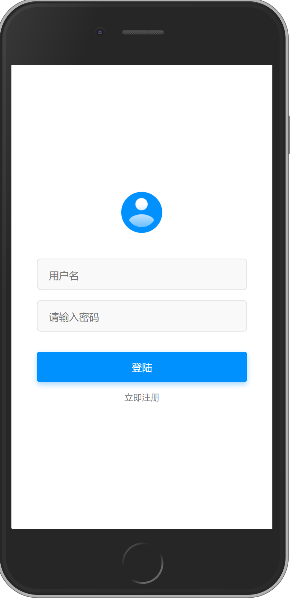

# jingdong

## Project setup
```
yarn install
```

### Compiles and hot-reloads for development
```
yarn serve
```

### Customize configuration
Vue3的练习作品<br/><br/>
项目功能：登陆注册· 首页展示· 商户详情· 订单管理<br/><br/>
Vue 技术应用：<br/>
· Composition API<br/>
· VueCLI<br/>
· Vue-Router<br/>
· VueX<br/>
——————————————<br/>
This is a Vue3 practice works<br/><br/>
Project function: login registration · homepage display · merchant details · order management<br/><br/>
Vue technology application:<br/>
· Composition API<br/>
· VueCLI<br/>
· Vue-Router<br/>
· VueX<br/>
——————————————<br/>
これはVue3の練習作品です<br/><br/>
プロジェクト機能：ログイン登録・ホームページ表示・加盟店詳細・注文管理<br/><br/>
Vue テクノロジーの適用:<br/>
· コンポジションAPI<br/>
· VueCLI<br/>
· Vue-Router<br/>
· VueX<br/><br/>




